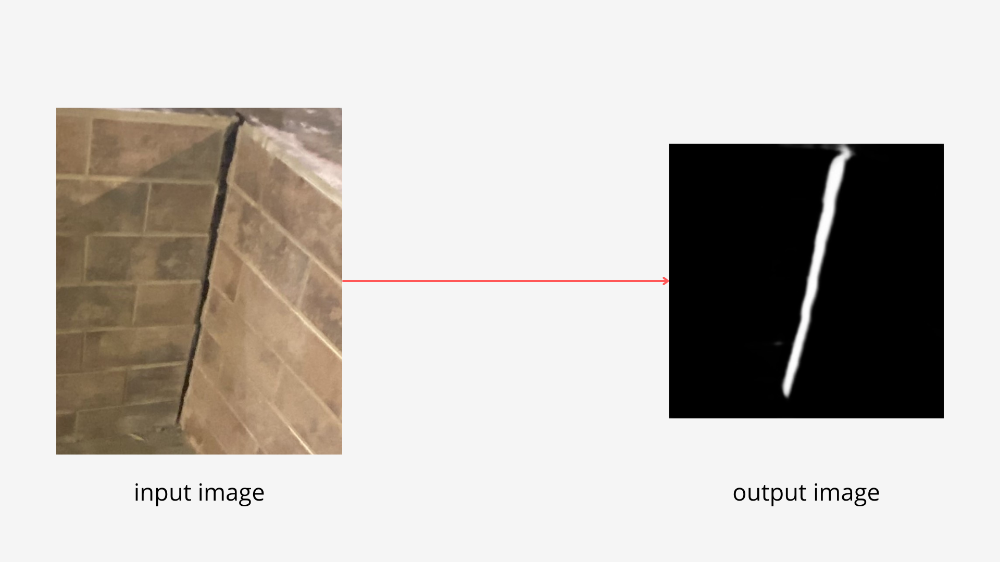

# Surface Crack Detection

## About 

This project is a deep learning model to detect cracks on civil engineering building elements. The model is based on the U-Net architecture and SAM (Segment Anything Model) loss function. The dataset used to train the model is the [Concrete Crack Images for Classification](https://data.mendeley.com/datasets/5y9wdsg2zt/2) dataset. 

## Getting Started

To run the project, you need to follow the steps below:

### Installation

```bash
    $ git clone
    $ cd surface_crack_detection
```

### Prerequisites

What things you need to have to be able to run:

  * Python 3.11 +
  * Pip 3+
  * VirtualEnvWrapper is recommended but not mandatory


### Requirements 

```bash
    $ pip install -r requirements.txt
```

### Running the project

#### Training the model
You can train your own model (classification or segmentation) by running the script below.
Each script is associated with a different model.

| Type of model  | Model          | Script                                                                      |
|----------------|----------------|-----------------------------------------------------------------------------|
| Classification | Resnet50       | python surface_crack_detection/models/resnet.py                             |
| Classification | VGG16          | python surface_crack_detection/models/vgg.py                                |
| Classification | InceptionV3    | python surface_crack_detection/models/inception.py                          |
| Segmentation | U-Net          | python surface_crack_detection/crack_segmentation/classes/train_evaluate.py |
| Segmentation and Classification | U-Net-Resnet50 | python surface_crack_detection/models/unet_resnet50.py                      |
| Segmentation and Classification | U-Net-Mobilnet | python surface_crack_detection/models/unet_mobilenet.py                     |
| Segmentation and Classication | SAM-Resnet50 | python surface_crack_detection/models/sam_resnet50.py |

#### Getting prediction
In case you just want to segment and classify an image with our trained model:
1. You must set the input directory that contains the images.
2. You can change the output directory, but by default the images will save in *surface_crack_detection/image_output* directory. (optional)
3. Run the script
```bash
$ python surface_crack_detection/models/model_predictions.py
```
By default, we use U-Net-Mobilenet model. The output of this script will save the segmented image on your device and classify it as either having a crack or not.





##  Publications related to this project

Bezerra, P. H. A., H. C. Dantas, L. M. G. Morais, and R. C. B. Rego. ["A Deep Learning Artificial Intelligence Algorithm to Detect Cracks on Civil Engineering Building Elements."](https://github.com/cilab-ufersa/surface_crack_detection/blob/develop/surface_crack_detection/CINPAR2024.pdf) In: XX International Conference on Building Pathology and Constructions Repair, 2024, Fortaleza. *XX International Conference on Building Pathology and Constructions Repair*. Fortaleza/CE, 2024. v. 1.
